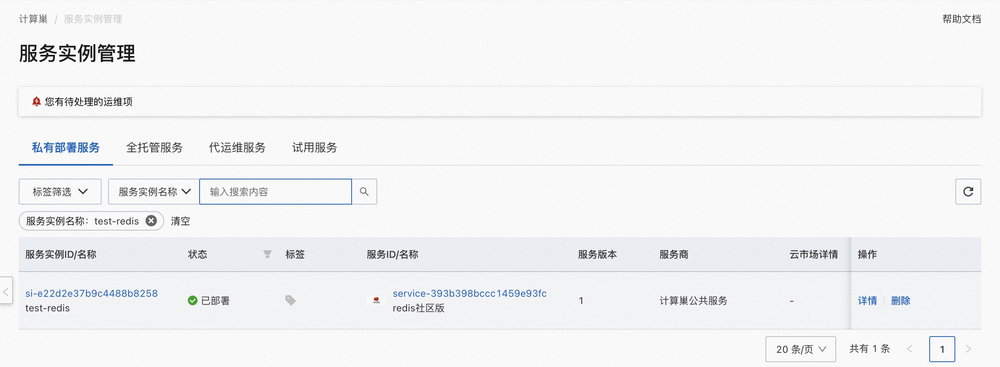
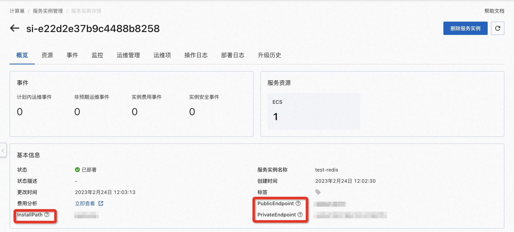

# redis社区版服务实例部署文档
## 概述
redis是一个高性能的HTTP和反向代理服务器。redis在计算巢上提供了社区版服务，您无需自行配置云主机，即可在计算巢上快速部署redis服务、实现运维监控，从而方便地基于redis搭建您自己的应用。本文向您介绍如何开通计算巢上的redis社区版服务，以及部署流程和使用说明。
## 计费说明
redis社区版在计算巢上的费用主要涉及：

- 所选vCPU与内存规格
- 磁盘容量
- 公网带宽

计费方式包括：

- 按量付费（小时）
- 包年包月

预估费用在创建实例时可实时看到。
## 
## 部署架构
redis社区版采用单机部署的架构。

## RAM账号所需权限
redis服务需要对ECS、VPC等资源进行访问和创建操作，若您使用RAM用户创建服务实例，需要在创建服务实例前，对使用的RAM用户的账号添加相应资源的权限。添加RAM权限的详细操作，请参见[为RAM用户授权](https://help.aliyun.com/document_detail/121945.html)。所需权限如下表所示。

| 权限策略名称 | 备注 |
| --- | --- |
| AliyunECSFullAccess | 管理云服务器服务（ECS）的权限 |
| AliyunVPCFullAccess | 管理专有网络（VPC）的权限 |
| AliyunROSFullAccess | 管理资源编排服务（ROS）的权限 |
| AliyunComputeNestUserFullAccess | 管理计算巢服务（ComputeNest）的用户侧权限 |
| AliyunCloudMonitorFullAccess | 管理云监控（CloudMonitor）的权限 |

## 部署流程
### 部署步骤
单击[部署链接](https://computenest.console.aliyun.com/user/cn-hangzhou/serviceInstanceCreate?ServiceId=service-393b398bccc1459e93fc)，进入服务实例部署界面，根据界面提示，填写参数完成部署。

### 
### 部署参数说明
您在创建服务实例的过程中，需要配置服务实例信息。下文介绍redis社区版服务实例输入参数的详细信息。

| 参数组        | 参数项     | 示例           | 说明                                                                        |
|------------|---------| --- |---------------------------------------------------------------------------|
| 服务实例名称     |         | test         | 实例的名称                                                                     |
| 地域         |         | 华东1（杭州）      | 选中服务实例的地域，建议就近选中，以获取更好的网络延时。                                              |
| 可用区配置      | 部署区域    | 可用区I         | 地域下的不同可用区域                                                                |
| 付费类型配置     | 付费类型    | 按量付费 或 包年包月  |
| 选择已有基础资源配置 | VPC ID  | vpc-xxx      | 选择专有网络的ID。                                                                |
| 选择已有基础资源配置 | 交换机ID   | vsw-xxx      | 选择交换机ID。若找不到交换机, 可尝试切换地域和可用区                                              |
| ECS实例配置    | 实例类型    | ecs.g7.large | 实例规格，可以根据实际需求选择                                                           |
| ECS实例配置    | 系统盘空间   | 40           | 系统盘空间，可以根据实际需求选择                                                          |
| ECS实例配置    | 数据盘空间   | 40           | 数据盘空间，可以根据实际需求选择                                                          |
| ECS实例配置    | 实例密码    | ********  | 设置实例密码。长度8~30个字符，必须包含三项（大写字母、小写字母、数字、()`~!@#$%^&*-+={}[]:;'<>,.?/ 中的特殊符号） |
| ECS实例配置    | 开启公网IP  | true      | 是否开启公网IP                                                                  |
| Redis配置    | Redis密码 | ********      | 密码必须包含8～30个字符，必须包含大写字母、小写字母、数字和特殊字符中的三种以上。, 长度8-30，必须包含三项（大写字母、小写字母、数字、 ()`~!@#$%^&*_-+={}[]:;'<>,.?/ 中的特殊符号）                                                                |

### 
### 验证结果

1. 查看服务实例。
服务实例创建成功后，部署时间大约需要2分钟。部署完成后，页面上可以看到对应的服务实例。 

2. 通过服务实例访问redis

进入到对应的服务实例后，可以在页面上获取到PublicEndpoint、PrivateEndpoint和InstallPath。

### 使用redis
请访问redis官网了解如何使用redis：[redis使用文档](https://redis.io/docs/)
